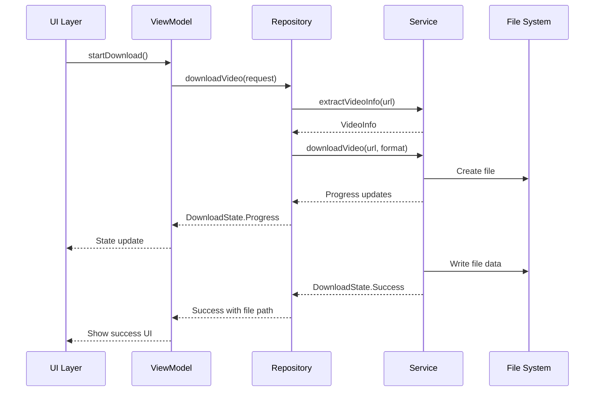

# 🏗️ Architecture Overview

Dokumentasi lengkap arsitektur Local YouTube Downloader Android, design patterns, dan struktur kode.

## 📐 Architecture Pattern

Aplikasi menggunakan **MVVM (Model-View-ViewModel)** dengan **Clean Architecture** principles untuk memastikan:
- **Separation of Concerns**
- **Testability**
- **Maintainability**
- **Scalability**

## 🎯 Architecture Layers

```
┌─────────────────────────────────────────┐
│                UI Layer                 │
│  (Jetpack Compose + Material Design 3) │
├─────────────────────────────────────────┤
│              ViewModel Layer            │
│     (State Management + Business Logic) │
├─────────────────────────────────────────┤
│             Repository Layer            │
│        (Data Access + Coordination)     │
├─────────────────────────────────────────┤
│              Service Layer              │
│    (External APIs + Download Engine)    │
├─────────────────────────────────────────┤
│               Data Layer                │
│      (Models + Utils + File System)     │
└─────────────────────────────────────────┘
```

## 📁 Project Structure

```
app/src/main/java/com/irnhakim/ytmp3/
├── 📱 ui/
│   ├── screen/
│   │   └── DownloadScreen.kt          # Main UI screen
│   └── theme/
│       ├── Color.kt                   # Color definitions
│       ├── Theme.kt                   # App theme
│       └── Type.kt                    # Typography
├── 🧠 viewmodel/
│   ├── DownloadViewModel.kt           # Main view model
│   └── CrashSafeDownloadViewModel.kt  # Crash-safe wrapper
├── 🗄️ repository/
│   ├── DownloadRepository.kt          # Main repository
│   └── CrashSafeDownloadRepository.kt # Crash-safe wrapper
├── 🔧 service/
│   ├── YouTubeExtractorService.kt     # yt-dlp integration
│   └── CrashSafeYouTubeExtractorService.kt # Crash-safe wrapper
├── 📊 data/
│   ├── VideoInfo.kt                   # Video information model
│   ├── DownloadState.kt               # Download state sealed class
│   ├── DownloadRequest.kt             # Download request model
│   └── DownloadFormat.kt              # Format enumeration
├── 🛠️ utils/
│   └── FileUtils.kt                   # File operations utilities
└── 📱 MainActivity.kt                 # Entry point
```

## 🎨 UI Layer (Presentation)

### Jetpack Compose
```kotlin
@Composable
fun DownloadScreen(
    modifier: Modifier = Modifier,
    viewModel: DownloadViewModel = viewModel()
) {
    val uiState by viewModel.uiState.collectAsState()
    val downloadState by viewModel.downloadState.collectAsState()
    
    // UI composition based on state
}
```

### Key Components
- **DownloadScreen**: Main UI composable
- **Material Design 3**: Modern design system
- **State-driven UI**: Reactive to ViewModel state changes
- **Compose Navigation**: (Future enhancement)

### UI State Management
```kotlin
data class DownloadUiState(
    val url: String = "",
    val selectedFormat: DownloadFormat = DownloadFormat.MP4,
    val isLoading: Boolean = false,
    val videoInfo: VideoInfo? = null,
    val showVideoInfo: Boolean = false,
    val errorMessage: String? = null
)
```

## 🧠 ViewModel Layer

### DownloadViewModel
```kotlin
class DownloadViewModel(application: Application) : AndroidViewModel(application) {
    private val repository = DownloadRepository(application)
    
    private val _uiState = MutableStateFlow(DownloadUiState())
    val uiState: StateFlow<DownloadUiState> = _uiState.asStateFlow()
    
    private val _downloadState = MutableStateFlow<DownloadState>(DownloadState.Idle)
    val downloadState: StateFlow<DownloadState> = _downloadState.asStateFlow()
}
```

### Responsibilities
- **State Management**: UI state dan download state
- **Business Logic**: Koordinasi antara UI dan Repository
- **Error Handling**: Transform errors untuk UI
- **Lifecycle Management**: Handle Android lifecycle

### State Flow Architecture
```
UI State Flow:
┌─────────┐    ┌──────────────┐    ┌─────────────┐
│   UI    │◄───│  ViewModel   │◄───│ Repository  │
│ (Compose)│    │ (StateFlow)  │    │   (Flow)    │
└─────────┘    └──────────────┘    └─────────────┘
```

## 🗄️ Repository Layer

### DownloadRepository
```kotlin
class DownloadRepository(private val context: Context) {
    private val youtubeExtractor = YouTubeExtractorService(context)
    
    suspend fun getVideoInfo(url: String): Result<VideoInfo>
    fun downloadVideo(request: DownloadRequest): Flow<DownloadState>
}
```

### Responsibilities
- **Data Coordination**: Koordinasi antara services
- **Business Rules**: Implementasi business logic
- **Error Transformation**: Convert service errors
- **Flow Management**: Manage download progress flows

### Download State Machine
```kotlin
sealed class DownloadState {
    object Idle : DownloadState()
    object Loading : DownloadState()
    data class Progress(val percentage: Int, val status: String) : DownloadState()
    data class Success(val filePath: String, val fileName: String) : DownloadState()
    data class Error(val message: String) : DownloadState()
}
```

## 🔧 Service Layer

### YouTubeExtractorService
```kotlin
class YouTubeExtractorService(private val context: Context) {
    suspend fun initializeYoutubeDL(): Result<Unit>
    suspend fun extractVideoInfo(url: String): Result<VideoInfo>
    suspend fun downloadVideo(url: String, outputDir: File, format: String, onProgress: (Float, Long, String) -> Unit): Result<String>
    suspend fun downloadAudio(url: String, outputDir: File, onProgress: (Float, Long, String) -> Unit): Result<String>
}
```

### Key Features
- **yt-dlp Integration**: YouTube video extraction
- **FFmpeg Support**: Audio/video processing
- **Progress Callbacks**: Real-time progress updates
- **Fallback System**: Multiple format attempts
- **Error Recovery**: Graceful error handling

### Download Engine Flow
```
┌─────────────┐    ┌─────────────┐    ┌─────────────┐
│ URL Input   │───►│ Video Info  │───►│ Format      │
│ Validation  │    │ Extraction  │    │ Selection   │
└─────────────┘    └─────────────┘    └─────────────┘
        │                   │                   │
        ▼                   ▼                   ▼
┌─────────────┐    ┌─────────────┐    ┌─────────────┐
│ Download    │───►│ Progress    │───►│ File        │
│ Execution   │    │ Tracking    │    │ Validation  │
└─────────────┘    └─────────────┘    └─────────────┘
```

## 📊 Data Layer

### Models
```kotlin
data class VideoInfo(
    val id: String,
    val title: String,
    val duration: String,
    val thumbnail: String,
    val uploader: String,
    val url: String,
    val formats: List<VideoFormat>
)

data class DownloadRequest(
    val url: String,
    val format: DownloadFormat
)

enum class DownloadFormat {
    MP4, MP3
}
```

### File Management
```kotlin
object FileUtils {
    fun getDownloadDirectory(context: Context): File
    fun generateFileName(title: String, extension: String): String
    fun getMimeType(filePath: String): String
    fun getContentUri(context: Context, file: File): Uri
    fun openFile(context: Context, filePath: String): Boolean
}
```

## 🔄 Data Flow

### Complete Data Flow
```
┌─────────────┐
│    User     │
│   Action    │
└──────┬──────┘
       │
       ▼
┌─────────────┐    ┌─────────────┐    ┌─────────────┐
│     UI      │───►│ ViewModel   │───►│ Repository  │
│ (Compose)   │    │             │    │             │
└─────────────┘    └─────────────┘    └─────────────┘
       ▲                   ▲                   │
       │                   │                   ▼
┌─────────────┐    ┌─────────────┐    ┌─────────────┐
│   State     │◄───│   State     │◄───│   Service   │
│  Update     │    │ Management  │    │   Layer     │
└─────────────┘    └─────────────┘    └─────────────┘
```

### Download Flow Sequence


## 🛡️ Error Handling Strategy

### Error Hierarchy
```kotlin
sealed class AppError : Exception() {
    data class NetworkError(override val message: String) : AppError()
    data class ValidationError(override val message: String) : AppError()
    data class FileSystemError(override val message: String) : AppError()
    data class ServiceError(override val message: String) : AppError()
}
```

### Error Propagation
```
Service Layer Error ──► Repository Layer ──► ViewModel ──► UI Layer
     (Technical)         (Business Logic)    (User State)   (User Message)
```

### Crash-Safe Wrappers
```kotlin
class CrashSafeDownloadRepository(
    private val delegate: DownloadRepository
) {
    suspend fun getVideoInfo(url: String): Result<VideoInfo> {
        return try {
            delegate.getVideoInfo(url)
        } catch (e: Exception) {
            Result.failure(AppError.ServiceError("Safe fallback: ${e.message}"))
        }
    }
}
```

## 🧪 Testing Architecture

### Testing Pyramid
```
┌─────────────────┐
│   UI Tests      │  ← Integration & E2E
│  (Instrumented) │
├─────────────────┤
│  Integration    │  ← Repository + Service
│     Tests       │
├─────────────────┤
│   Unit Tests    │  ← ViewModel + Utils
│  (Local JVM)    │
└─────────────────┘
```

### Test Structure
```
app/src/test/java/com/irnhakim/ytmp3/
├── BasicFunctionalityTest.kt      # Core functionality
├── DownloadRepositoryTest.kt      # Repository layer
├── DownloadViewModelTest.kt       # ViewModel layer
├── FileUtilsTest.kt              # Utility functions
├── IntegrationTest.kt            # Cross-layer integration
├── NetworkTest.kt                # Network operations
├── RealDownloadTest.kt           # Real download scenarios
└── YouTubeIntegrationTest.kt     # YouTube API integration
```

## 🔧 Dependency Injection

### Manual DI Pattern
```kotlin
class DownloadViewModel(application: Application) : AndroidViewModel(application) {
    private val repository = DownloadRepository(application)
    // Dependencies injected through constructor
}

class DownloadRepository(private val context: Context) {
    private val youtubeExtractor = YouTubeExtractorService(context)
    // Service dependencies created internally
}
```

### Future Enhancement: Hilt/Dagger
```kotlin
@HiltAndroidApp
class YTMPApplication : Application()

@Module
@InstallIn(SingletonComponent::class)
object AppModule {
    @Provides
    @Singleton
    fun provideDownloadRepository(@ApplicationContext context: Context): DownloadRepository {
        return DownloadRepository(context)
    }
}
```

## 📱 Android Integration

### Permissions
```xml
<uses-permission android:name="android.permission.INTERNET" />
<uses-permission android:name="android.permission.WRITE_EXTERNAL_STORAGE" />
<uses-permission android:name="android.permission.READ_EXTERNAL_STORAGE" />
```

### FileProvider Configuration
```xml
<provider
    android:name="androidx.core.content.FileProvider"
    android:authorities="${applicationId}.fileprovider"
    android:exported="false"
    android:grantUriPermissions="true">
    <meta-data
        android:name="android.support.FILE_PROVIDER_PATHS"
        android:resource="@xml/provider_paths" />
</provider>
```

### Lifecycle Integration
```kotlin
class DownloadViewModel : AndroidViewModel {
    override fun onCleared() {
        super.onCleared()
        // Cleanup resources
        viewModelScope.cancel()
    }
}
```

## 🚀 Performance Considerations

### Memory Management
- **StateFlow** instead of LiveData for better performance
- **Lazy initialization** of heavy components
- **Proper lifecycle management** to prevent leaks
- **Efficient Compose recomposition**

### Background Processing
- **Coroutines** for asynchronous operations
- **IO Dispatcher** for file operations
- **Default Dispatcher** for CPU-intensive tasks
- **Main Dispatcher** for UI updates

### File System Optimization
- **Streaming downloads** to avoid memory issues
- **Progress callbacks** for responsive UI
- **Atomic file operations** to prevent corruption
- **Cleanup mechanisms** for failed downloads

## 🔮 Future Architecture Enhancements

### Planned Improvements
1. **Dependency Injection**: Hilt/Dagger integration
2. **Room Database**: Download history and metadata
3. **WorkManager**: Background download queue
4. **Navigation Component**: Multi-screen navigation
5. **Modularization**: Feature-based modules

### Scalability Considerations
- **Multi-module architecture** for large teams
- **Feature flags** for gradual rollouts
- **Plugin architecture** for extensibility
- **Microservices integration** for cloud features

---

**Architecture Documentation** 📚 Complete overview of the application structure and design decisions.
